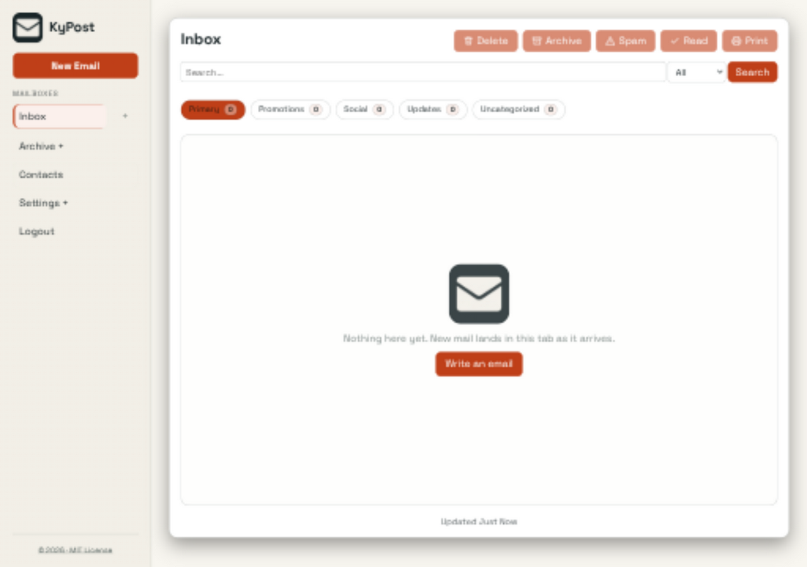
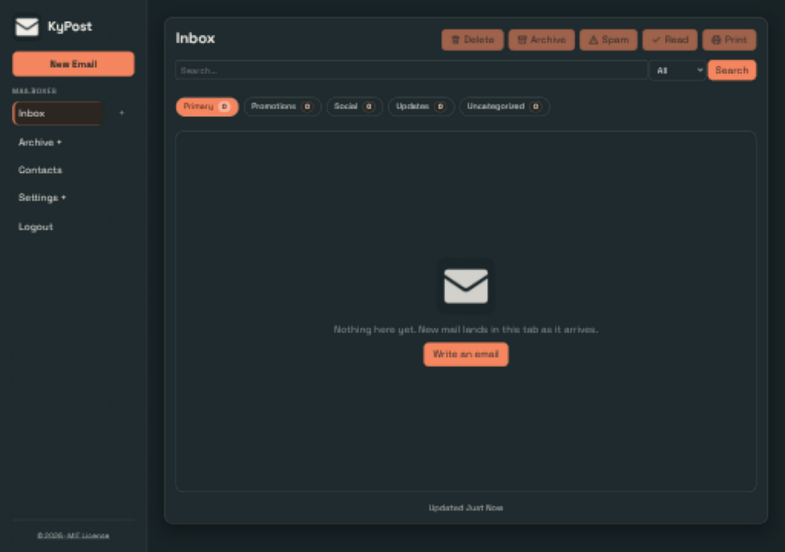
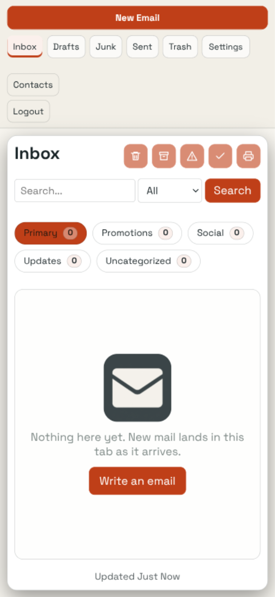
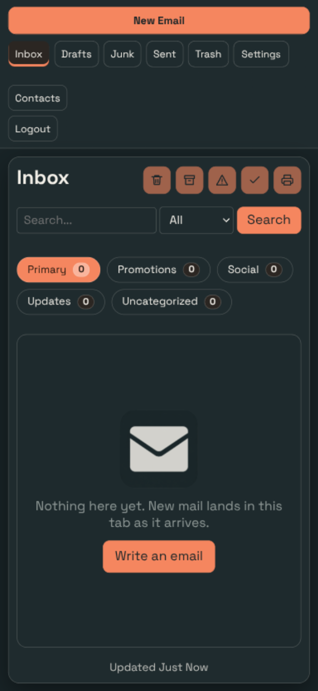

# Shared UI verification

## Change

Allow grid columns and the search input to shrink on mobile; preserve stylesheet-free mail-rendering palette values. Shared assets are pinned to ky-ui 0.2.0 with content hashes. Product layouts, saved theme keys and named presets remain local.

## Capture conditions

Captured 2026-09-25 from this branch, using the application UI (not a design mockup). Inbox in a real scratch server, signed in after first-run password rotation. No mail account, SMTP or Ollama connected.

OS-following Busnes Light and Dark were captured at 1280×900 and 390×844 CSS pixels. Browser device scaling may make PNG dimensions larger. Document width stayed within the viewport in these captured states; local navigation/table scrolling is intentional. Screenshots show the selected-page accent, not a complete accessibility audit.

Mail delivery and classification are not exercised without IMAP/SMTP/Ollama.

## Checks

912 frontend tests and production build passed after the mobile adjustments. Central ky-ui sync --check verified all ten consumers. Screenshot coverage is Busnes Light/Dark; existing named choices are retained, but not every named palette/page combination was visually exercised.

## Screenshots

| Light | Dark |
| --- | --- |
|  |  |
|  |  |

## Reproduce

Run npm ci, npm test (where configured), and npm run build in frontend/, then start the product with isolated local preview data following its README. Use System theme, emulate OS light/dark, and inspect both viewport sizes. Do not point preview instances at production data. For KyVault, use a configured development KyIdentity or explicitly labeled read-only browser fixtures; never bypass backend authentication.

## Native mail setup screen — 2026-10-04

Checked the production bundle through the T3 collaborative browser against an
isolated KyPost server with fresh scratch data. Completed real bootstrap login
and password rotation, then opened `/admin/server?tab=mail-domain`. Inspected the
unconfigured setup at 1280×800 and its refused-change state at 390×844. Document
width remained within both viewports (1265 and 375 CSS pixels respectively).

Submitted a test challenge with the current converted account credential and
the shared CSRF client. Missing KyIdentity correctly returned 503, created no
domain claim, cleared the password and disabled further changes until reload.
No real issuer, DNS proof, relay, recipient or mail delivery was configured.
Configured/SSO/rotation states are covered by Vitest, not these browser captures;
no complete accessibility audit is implied. Final frontend qualification:
926 tests, typecheck, production build and runtime dependency audit passed.
