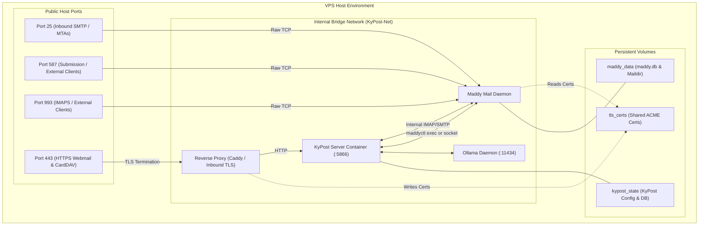

# Handoff: Bundled Mail Server Appliance via Maddy

## 1. Executive Summary & Architectural Decision

### Decision: Use Maddy Mail Server as an Orchestrated Sidecar
- **Selected Engine:** [Maddy Mail Server](https://github.com/foxcpp/maddy) (`foxcpp/maddy:latest`).
- **Rejected Alternatives:**
  - *Stalwart Mail Server:* Rejected as too enterprise, oversized memory footprint (~250–500MB), complex directory models, and RocksDB storage engine overhead.
  - *Postfix + Dovecot (docker-mailserver):* Rejected due to multi-daemon orchestration inside one container, high memory (~500MB–1GB), and brittle configuration file templating.
  - *In-Process Custom Go Engine (`emersion/go-imap` + `emersion/go-smtp`):* Rejected due to high engineering risk (6–8+ weeks to write a compliant, queueing, bounce-handling, rate-limiting outbound MTA).
- **Why Maddy:**
  - **Philosophy Match:** Single static Go binary, clean and minimal, matching KyPost's Go stack and operational philosophy.
  - **Resource Footprint:** 40MB–70MB idle RAM.
  - **Storage Simplicity:** Pure SQLite (`maddy.db`) and plain filesystem Maildir storage. Backups seamlessly plug into KyPost's existing sealed backup mechanism (`docs/RESTORE.md`).
  - **Batteries Included:** Built-in SMTP, IMAP4rev1, DKIM signing, SPF verification, and DMARC enforcement.

---

## 2. Deployment Topology: Production VPS vs. Demo Server

### Crucial Difference from the Demo Server
The demo stack in [`kypost-demo-IMAP`](file:///home/yoshi/busness.app/kypost-demo-IMAP/docker-compose.yml) operates strictly behind a **Cloudflare Tunnel** container with no public mail ports exposed. **This model cannot be duplicated directly for a production mail server:**
1. **Cloudflare HTTP Tunnels do not support public arbitrary inbound SMTP (Port 25).** External MTAs (Gmail, Outlook, iCloud) must be able to route directly to port 25 on the VPS public IP.
2. **Reverse DNS (PTR) & Port 25 Outbound:** A production mail server must bind to the host's public IP so its PTR record matches the HELO/EHLO identity.
3. **VPS Port 25 Outbound Block:** Many cloud providers (Hetzner, DigitalOcean, Linode, AWS) block outbound port 25. The appliance **must support an optional outbound Smarthost / Relay** (e.g. Amazon SES, Postmark, Brevo) configurable directly from KyPost.

### Architecture Diagram



### Proposed Compose File (`docker-compose.appliance.yml`)

```yaml
name: kypost-appliance

networks:
  kypost-net:
    name: kypost-net
    driver: bridge
    ipam:
      config:
        - subnet: 10.89.0.0/24

volumes:
  kypost_config:
  kypost_private:
  kypost_logs:
  kypost_state:
  maddy_data:
  tls_certs:

services:
  kypost-server:
    image: ${KYPOST_IMAGE:-ghcr.io/busnes-app/kypost-server}:${KYPOST_VERSION:-stable}
    container_name: KyPost-Server
    restart: unless-stopped
    networks:
      kypost-net:
        ipv4_address: 10.89.0.5
    environment:
      WEB_PORT: 5866
      KYPOST_BIND: 127.0.0.1
      TRUSTED_PROXY_CIDRS: 10.89.0.2/32
      APPLIANCE_MODE: "true"
      MADDY_HOST: "kypost-mail"
      MADDY_CONTROL_SOCKET: "/kypost/mail-run/maddy.sock"
      OLLAMA_BASE_URL: "http://127.0.0.1:11434"
    volumes:
      - kypost_config:/kypost/config
      - kypost_private:/kypost/private
      - kypost_logs:/kypost/logs
      - kypost_state:/kypost/state
      - maddy_data:/kypost/maddy-data:ro
      - tls_certs:/kypost/tls:ro

  kypost-mail:
    image: foxcpp/maddy:latest
    container_name: KyPost-Mail
    restart: unless-stopped
    networks:
      kypost-net:
        ipv4_address: 10.89.0.10
    ports:
      - "25:25"      # Inbound SMTP
      - "587:587"    # Submission
      - "993:993"    # IMAPS
    environment:
      MADDY_HOSTNAME: ${MAIL_DOMAIN:?set MAIL_DOMAIN in .env}
      MADDY_DNS: "1.1.1.1"
    volumes:
      - maddy_data:/data
      - tls_certs:/certs:ro
    security_opt:
      - no-new-privileges:true
    cap_drop:
      - ALL
    cap_add:
      - NET_BIND_SERVICE
      - CHOWN
      - SETUID
      - SETGID
      - DAC_OVERRIDE
```

---

## 3. KyPost Backend Integration & Provisioning Flow

### Automatic Provisioning
When a user is created in KyPost (via Admin UI, self-registration, or directory sync via `POST /api/sync/webhook`):
1. **Mailbox Generation**: KyPost invokes the Maddy management layer (either via Unix socket `maddyctl` exec or direct interaction with Maddy's SQLite database):
   ```bash
   maddyctl creds create <username>@<domain>
   maddyctl imap-acct create <username>@<domain>
   ```
2. **Managed Credential Storage**: KyPost writes the generated credentials into `/kypost/private/users/<id>/imap.json` with `Managed: true` via [`mailmsg.IMAPConfigPayload`](file:///home/yoshi/busness.app/kypost-server/backend/internal/mailmsg/smtp_send.go#L30-L37) and [`handleAdminUserIMAPConfig`](file:///home/yoshi/busness.app/kypost-server/backend/internal/api/server_admin_mailbox.go#L30).
   - Setting `Managed: true` locks the user's settings tab to read-only so they cannot accidentally break their internal mail server link.
3. **Offboarding**: When an admin deactivates a user or a KySignOn SCIM event arrives (`user.updated{active:false}` or `user.deleted`):
   - KyPost deactivates/locks the user's Maddy credentials.
   - **Never delete the mailbox data automatically** (following KyPost's strict principle: offboarding revokes access, never data).

---

## 4. Production Mail Deliverability Features

To make this practical for real-world VPS hosting, KyPost must provide two key capabilities in the Admin UI:

### A. DNS Diagnostic & Verification Helper
Under **Admin > Email Server > DNS Setup**, KyPost should display the exact records needed and query live public DNS resolvers:
- **MX Record:** `10 mail.yourdomain.com`
- **A Record:** `mail.yourdomain.com -> <VPS IP>`
- **SPF TXT:** `v=spf1 mx ~all`
- **DKIM TXT:** Display Maddy's generated public key DNS entry: `default._domainkey.yourdomain.com TXT "v=DKIM1; k=rsa; p=..."`
- **DMARC TXT:** `v=DMARC1; p=quarantine; rua=mailto:postmaster@yourdomain.com`
- **PTR (rDNS):** Warn the operator if VPS reverse DNS does not match `mail.yourdomain.com`.

### B. Outbound Relay / Smarthost Support
Under **Admin > Email Server > Outbound Relay**:
- Allow operators whose VPS provider blocks outbound port 25 to toggle **Enable Smarthost Relay**.
- Fields: Relay Host, Port (587/465/2525), Username, Password, TLS requirement.
- When enabled, KyPost updates Maddy's configuration to forward external outbound mail through the relay while delivering local mail directly.

---

## 5. Work Effort & Implementation Plan

Estimated total effort: **2 to 3 weeks**.

### Phase 1: Maddy Integration & Docker Orchestration (3–4 days)
- Create `docker-compose.appliance.yml` bundling `kypost-server` and `kypost-mail` (Maddy).
- Define default `maddy.conf` template supporting SQLite, local Maildir, DKIM signing, and TLS certificate loading.
- Verify internal Docker network connectivity: KyPost communicating with Maddy over `KyPost-Net` on ports 143/993 and 587.

### Phase 2: Provisioning & Go Adapter Layer (4–5 days)
- Create a Go package `backend/internal/maddy`:
  - Interface for managing accounts: `CreateAccount`, `SetPassword`, `DeactivateAccount`, `GetStatus`.
  - Implementation using a controlled CLI wrapper or direct SQLite helper.
- Hook into user creation lifecycle ([`backend/internal/api/server_users.go`](file:///home/yoshi/busness.app/kypost-server/backend/internal/api/server_users.go) and [`backend/internal/api/sync_handlers.go`](file:///home/yoshi/busness.app/kypost-server/backend/internal/api/sync_handlers.go)).
- Automatically write `mailmsg.IMAPConfigPayload{Managed: true}` for provisioned users.

### Phase 3: Admin UI & Deliverability Controls (3–4 days)
- Add "Email Server" panel to the Admin settings tab in the frontend SPA.
- Display DKIM key, required DNS records, and a live "Check DNS" probe button.
- Add Smarthost/Relay configuration UI and Maddy config reloader.

### Phase 4: Sealed Backup & Restoration (2–3 days)
- Update [`backend/internal/backup`](file:///home/yoshi/busness.app/kypost-server/docs/RESTORE.md) to include `/kypost/maddy-data` (SQLite database + Maildir) in scheduled sealed backups.
- Update the offline restore tool to verify and unpack Maddy data alongside KyPost state.

---

## 6. Gotchas & What Will Bite You

1. **Port 25 Inbound Permissions in Docker:**
   - Binding port 25 requires `cap_add: [NET_BIND_SERVICE]` if Maddy runs as a non-root user.
2. **File Permissions Across Containers:**
   - Both KyPost and Maddy run as non-root users. If sharing volumes or sockets, ensure UIDs/GIDs are aligned or sockets are permissions-gated (0660 with shared GID).
3. **TLS Certificate Reloading:**
   - When ACME (Caddy/Certbot) renews Let's Encrypt certificates, Maddy must reload its TLS state (via `SIGHUP` or maddy control command).
4. **SQLite Concurrency & Backups:**
   - Maddy uses SQLite WAL mode. Live backups must perform a WAL checkpoint (`VACUUM INTO` or SQLite online backup API) rather than blindly copying `maddy.db` while active writes are pending.
