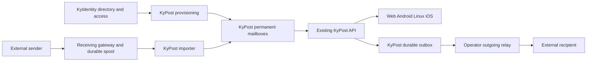

# KyPost turnkey domain mail stack plan

Status: approved implementation plan, 2026-10-03. Phase 1 feasibility checks, caller audit and internal receiving-buffer implementation are in [the evidence record](TURNKEY_MAIL_PHASE1.md). Maddy's synchronous command boundary is the selected implementation candidate; controlled directory/runtime receiving integration has runnable checks; representative storage and public deployment gates remain open. No production reception capability has shipped. New dependencies and production cutover remain separate approvals.

Qualification progress: admin mail-domain DNS proof and opt-in prepare-before-publication allocation/runtime are implemented in [the provisioning contract](NATIVE_PROVISIONING.md). Sealed backups now snapshot the internal mailbox and receiving databases, including committed WAL rows, and drills check SQLite integrity; see [restore limits](RESTORE.md). Historical ownership validation and held private restore publication are implemented; current-authority repair, stale-ID fencing and power-loss qualification remain open. Native provisioning and API/daemon selection require KYPOST_NATIVE_MAIL=true; KYPOST_NATIVE_RECEIVING=true additionally selects trusted-local receiving commands and daemon import for controlled qualification. Direct receiving also has physical/free-space admission estimates with accepted-mail recovery at closed admission; hard volume quotas and public capacity qualification remain pending. Native primary-address sending uses the operator-owned relay and durable outbox; Server → Mail domain guides domain/relay configuration. The saved relay has a protected no-mail TLS/AUTH check; actual delivery qualification, bundled public reception and full deployment setup remain pending. A [controlled receiver configuration generator](RECEIVING_SETUP.md) removes handwritten bridge rules; an optional Compose profile now supervises the operator-supplied pinned engine with explicit publication and fresh startup admission. A repeatable host-side wizard guides the existing setup UI and explicit profile preparation/start; live external observations remain manual. Public adoption gates remain. Qualify hold release, mail-sized backup capacity and receiver cutover before production reception. Do not change production MX for these foundations.

## Outcome and scope

Deploy one stack, connect a domain and KyIdentity, supply the operator's outgoing relay credentials, and complete DNS verification. Assign a person to KyPost in KyIdentity and give them a working mailbox without individual IMAP/SMTP setup. Disable their account to revoke access without deleting mail; reactivation restores the same mailbox.

KyPost remains the product and client API. Android and web validate the first release; existing Linux and iOS contracts remain supported at their current capability level. Client feature parity is separate work. Preserve external IMAP mode for existing deployments.

Separate three responsibilities: a receiving gateway holds accepted mail durably; KyPost owns permanent mailboxes; the operator's external relay delivers outgoing mail. The gateway may be a separate process/container. Mailbox storage and the outbox belong in the Go backend; do not add a new sending microservice. Busnes operates no shared email transport.

First release: several verified domains per deployment, several mailboxes per user (each with its own addresses), explicit aliases, existing folders/labels/search/attachments/drafts/Sent, existing PGP modes and notifications, guided setup, user mail import (external IMAP, standard files) and export, backup and restore. Shared inboxes, calendars, public IMAP/JMAP servers, simultaneous receiving providers for one deployment, and a Mailflare UI replacement are outside this first release. Evaluate a gateway independently of a full mailbox server or Mailflare fork.

## Architecture

The receiver's spool is a delivery buffer, not the user's mailbox. Once KyPost has committed all intended local deliveries, it acknowledges the gateway item. Spool cleanup follows that acknowledgment and the configured retention policy. Provider-side copies and earlier backups have their own retention; local encryption cannot erase them.

## Current code to reuse

| Existing surface | Planned use |
| --- | --- |
| [Mail client interface](../backend/internal/adapters/imap/client.go), [API client selection](../backend/internal/api/server_userscope.go), [poller client selection](../backend/internal/processor/poller.go) | Add a local mailbox implementation alongside external IMAP; audit concrete IMAP assumptions and both construction paths. Extract shared types only where two implementations require it. |
| [Inbox API](../backend/internal/api/server_inbox.go) and [client baseline](PLATFORM_BASELINE.md) | Preserve message addressing, folder actions, paging, body/attachment shapes and device authentication. Local IDs must not be derived from provider IDs. |
| [Directory sync](../backend/internal/api/sync_handlers.go) | Retain verified issuer/subject identity and signed, versioned desired-state events; add durable provisioning and repair. |
| [Mail composition](../backend/internal/api/server_mail_send.go), [mail helpers](../backend/internal/mailmsg/), [PGP contract](E2E_PGP.md) | Reuse MIME construction, envelope validation, SMTP normalization, encrypted Sent copies and client-encrypted relay behavior. |
| [Existing dependencies](../backend/go.mod) | Reuse SQLite, MIME parsing and OpenPGP libraries. Native storage needs no new database service. |
| [Mail cache contract](../backend/internal/mailcache/AGENTS.md) | Keep it rebuildable; do not promote its bounded windows to authoritative storage. |
| [Backup adapter](../backend/internal/backup/AGENTS.md), [restore runbook](RESTORE.md) | Extend collection and drills to include authoritative mail, ingress receipts and the outbox. Current backup excludes external IMAP mail. |

## Proposed data and reliability contracts

These are implementation requirements. Freeze schema and API details after the phase 1 compatibility proof.

- Start with a dedicated per-user SQLite mailbox database using the installed driver. Store complete RFC5322 message bytes as bounded BLOBs plus metadata in the same transactional store, so a mailbox commit cannot reference an absent file. Benchmark storage, streaming, WAL growth and backup size before committing this representation for release; external blob files are a measured optimization requiring their own crash-recovery contract.
- Give local messages server-generated internal IDs and stable numeric API IDs compatible with current native clients. Scope lookups to the authenticated user and mailbox. Specify move/replacement ID behavior, folder generations, source-mode changes, cursor reset and stale-reference rejection before rollout. Never reuse deleted IDs, hash provider IDs into UIDs, or let a stale IMAP reference resolve to unrelated local mail.
- Persist folder membership, flags, arbitrary validated labels, message dates, raw headers and revision/tombstone records. Page using a stable ordering. A cursor beyond retained history must explicitly require full resynchronization; no silent truncation.
- Ingress records include the authenticated gateway identity, delivery ID, SMTP envelope and payload digest. At acceptance, bind each recipient to its immutable mailbox owner and routing generation from the authenticated directory snapshot. Pickup verifies that binding rather than resolving today's alias owner; stale/conflicting bindings are quarantined. Deduplicate by gateway/delivery/bound-mailbox identity, not the sender's Message-ID. The same idempotency key with different bytes or bindings is an explicit conflict. Confirm all local recipients independently before acknowledging an item.
- The gateway persists raw bytes and envelope before accepting responsibility upstream. Pickup supports bounded reads, leases or equivalent exclusive claims, acknowledgment and restart reconciliation. Failed import, unavailable classification, lost acknowledgment and KyPost downtime must preserve accepted mail. Enforce capacity limits, warn before exhaustion, and temporarily refuse new acceptance when durable storage is unavailable. Unknown recipients are rejected where the receiving transport permits it; already-accepted unroutable mail is quarantined visibly.
- Use KyIdentity issuer/subject as ownership, with explicit unique primary address and alias mappings. Domain ownership must be proved before enabling reception or sending. Address changes reserve prior names until deliberate reassignment; an email/name collision never transfers an existing mailbox. Disabled users lose access immediately; the gateway rejects new delivery to disabled addresses when its directory is current, while in-flight accepted items are retained for reconciliation/quarantine.
- Block abusive sender domains with an escalating cooldown, in both receiving profiles, enforced at the gateway before storage. Automatic blocks count only mail whose sender domain is DKIM-authenticated, so a spoofed envelope cannot get a legitimate domain blocked; administrators can block or unblock any domain manually.
- Directory acknowledgment means desired state and any necessary provisioning intent are durable, not that an external gateway already applied them. Expose pending/applied/failed provisioning, retry idempotently, and repair after restore. Before a mailbox becomes ready, verify gateway routing and local access state agree. Gateways use authenticated routing snapshots with revisions and a defined maximum staleness; stale routing pauses fresh acceptance rather than guessing. Approved exception (2026-10-06) for the hosted Cloudflare profile, whose gateway can only reject permanently: it keeps accepting against the last signed snapshot for at most 14 days, and mail whose frozen generation no longer matches is quarantined locally, never delivered ([design](CLOUDFLARE_CONTINUOUS_RECEIVING.md)). Recheck user liveness on every read/send.
- The durable outbox stores envelope recipients separately from exact wire MIME and the appropriate Sent copy. No Bcc header leaks into recipient-visible MIME. Encrypted PGP deliveries persist transport ciphertext and opaque key material only. Existing client-protected signed-only delivery deliberately has cleartext multipart/signed wire MIME: encrypt that queued payload at rest using a server-held key, disclose server custody and preserve the separately encrypted Sent copy. This is not end-to-end confidentiality. Preserve existing private-key protection; outbox encryption at rest is a separate guarantee.
- Immediately before submission, the outbox worker revalidates active account, approved From/alias, relay configuration and the device/key generation where required by the existing PGP contract. Coordinate the durable submitting claim with access/alias revocation; that claim is the authorization boundary. Revoked jobs not yet claimed are canceled/quarantined. Report already-authorized in-flight submissions because mail handed to a relay cannot be recalled. Never hold a directory/global lock across network I/O.
- Track queued, submitting, accepted-by-relay, retryable failure, permanent failure and uncertain acceptance per delivery. SMTP cannot guarantee exactly-once delivery after a lost final response. On uncertainty, reconcile with provider evidence where available or require an explicit retry decision; never automatically resend merely because a lease expired. Relay acceptance is not recipient delivery. Retry Sent-copy filing without resending accepted mail. Preserve the send response's current semantics for existing clients; do not turn success into merely queued without a negotiated/additive API change.
- Preserve the shipped PGP opt-in, key-protection, signing and device-enrollment contracts. Existing encrypted mail remains exact MIME. Incoming ordinary mail may be stored plaintext under the current disclosed policy, then replaced through a verified ciphertext commit; the spool, WAL, indexes and backup retention remain explicit exposures. Do not claim end-to-end protection for mail received in plaintext or silently broaden encryption eligibility. Unavailable keys or failed encryption keep the source recoverable and report the condition. New storage replacement must retain the existing pending-key guards and durable ciphertext-only recovery behavior.
- Classification and notifications run after durable mailbox acceptance. Reuse existing privacy guards and retry behavior; account for incoming encryption ordering explicitly. Do not index decrypted PGP bodies or train on plaintext that the current encryption policy omits. Search encrypted mail by permitted metadata; label corrections must retain current learning restrictions.

## Implementation phases

Each phase is a separate reviewable change set with a runnable acceptance check. Stop promotion on a failed gate, preserve accepted mail, and repair before continuing. Calendar estimates follow phase 1 evidence rather than guessed rewrite durations.

### Phase 1 — Prove the boundaries and choose one receiving gateway

Map every caller of mail operations, including native endpoints, send-as proofs, header filtering, incoming encryption, cache warming and attachments. Inventory Android/web request and response behavior and the existing Linux/iOS baseline. Check receiver candidates for durable spool/pickup, envelope preservation, domain routing, abuse controls, quotas, licensing and maintenance; use an existing maintained SMTP receiver rather than writing the SMTP protocol.

Two receiving profiles, one per deployment: Cloudflare Email Routing to an operator-owned Worker and private bucket ([pilot](CLOUDFLARE_RECEIVING.md)) is primary and needs no inbound port; a bundled receiver (Maddy) with persistent spool and reachable inbound SMTP remains supported for operators who will not route mail through Cloudflare. Setup discloses each profile's trust and exposure trade-off. Existing external IMAP/SMTP accounts remain a permanent, supported alternative to both, not a migration-only path. Outgoing mail always uses the operator's relay. Select and pin one receiver only after proving that its actual delivery interface satisfies the pickup contract; design a minimal ingestion bridge only if necessary and record any dependency approvals.

Build a disposable local storage/API proof with the installed SQLite/MIME tooling. Demonstrate that a raw message can be listed, opened and downloaded through existing endpoints with stable IDs. Measure a representative test mailbox larger than existing cache/query windows and real-size attachments. Decide BLOB storage suitability and receiver deployment profile from measured results.

**Exit:** documented receiver selection with runnable crash/pickup proof; complete caller inventory; Android/web compatibility evidence; explicit Linux/iOS gaps; no changed client wire semantics and no production mail or MX changes. A Mailflare fork is adopted only if it demonstrably reduces this work and its AGPL obligations are accepted.

### Phase 2 — Implement authoritative local mailbox storage

The internal permanent storage and import foundation is implemented; [the evidence record](TURNKEY_MAIL_PHASE1.md#permanent-storage-and-import-follow-up) records its checks and remaining boundaries. The complete internal mail-client adapter is also implemented; [native Client evidence](TURNKEY_MAIL_PHASE1.md#native-mail-client-follow-up) records API and PGP read checks. Native incoming-encryption replacement/recovery also has [internal implementation evidence](TURNKEY_MAIL_PHASE1.md#native-incoming-encryption-recovery). Immutable account/cache source admission and safe full-snapshot native HTTP have [internal evidence](TURNKEY_MAIL_PHASE1.md#source-admission-and-safe-native-snapshots). Source switching is refused; new native state requires exclusive new-account provisioning. Complete durable scoped deltas, migration/restore contracts and verified provisioning before activation. Support raw-message storage, system/user folders, labels, flags, bounded body/attachment reads, drafts, Sent, search, stable IDs and durable deltas. Select mailbox source explicitly per account, defaulting existing users to external IMAP. Update both API and daemon selection; eliminate only the IMAP coupling needed for the second implementation. Keep mailbox source switches guarded until a migration procedure exists.

**Exit:** API-level parity for listing, read/unread, search, labels, folder changes, moves, trash/delete, drafts and attachments; owner isolation; restart persistence; complete pagination beyond bounded cache windows; source-switch/cursor collision checks. Re-run existing IMAP regression checks.

### Phase 3 — Add durable receiving and KyIdentity provisioning

Supported verified directory desired fields now persist beside the revision/access fence; atomic internal new-account preparation has [implementation evidence](TURNKEY_MAIL_PHASE1.md#durable-directory-desired-state-and-native-account-preparation). Durable internal assignment/address reservations and revision-fenced preparation reconciliation now have [a contract and checks](NATIVE_PROVISIONING.md). Explicit native-mail mode now provisions retained signed subjects and selects local mailboxes; separate native-receiving mode adds trusted-local commands and daemon import with runtime ownership/recovery checks. Public receiver deployment remains gated. Install the selected gateway, recipient routing and scoped pickup credentials. Implement import, receipts, claims/leases, acknowledgment and recovery. Build provisioning from durable desired state plus periodic repair, including primary addresses, explicit aliases, collision handling, deactivation and reactivation. Retain mail when access is revoked. Avoid arbitrary shared mailbox creation in this phase. Add spam/size/rate handling and trusted provenance for gateway authentication verdicts; never trust sender-written Authentication-Results as a gateway verdict.

**Exit:** assign a KyIdentity user and receive mail without per-user setup; reject/quarantine unknown or disabled recipients according to the contract; import attachments and multi-recipient deliveries correctly; kill/restart gateway/importer before and after each commit/ack boundary with no lost accepted mail and no duplicate local deliveries. Reassign an address while mail is queued and prove the new owner never receives the old owner's accepted delivery. Show recovery after quota exhaustion and directory replay/reordering.

### Phase 4 — Add administrator-configured relay delivery and outbox

The shared SMTP boundary now distinguishes definite final DATA refusal from
lost/invalid acknowledgment and accepted-then-teardown failure. Pickup records
survive uncertain notification acceptance. This is a transport prerequisite;
protected [domain relay settings](DOMAIN_RELAY.md), strict implicit-TLS/AUTH
transport qualification and sealed credential backups are implemented. Durable
[outbox storage/claims/Sent and sealed recovery](NATIVE_OUTBOX.md) are internally
qualified through loopback TLS and killed submitters. Primary-address compose/client-PGP current admission, joined recovery workers
and owned status diagnostics are integrated and locally TLS/PGP qualified.
Pickup/alias/system routes, provider delivery qualification/full setup and uncertainty
reconciliation tooling remain pending.

Integrate the protected domain relay setting and durable outbox with explicit allowed sender domains and current address authorization. Protect configuration/secret rotation with existing admin authentication, CSRF and action-bound step-up; secret reads remain redacted. Reuse SMTP helpers and route every sending path through the shared delivery boundary: ordinary compose, client-encrypted sends, pickup notifications, alias proofs and system mail where applicable. Verify domain sending readiness and provider restrictions. Retry temporary failures with bounded backoff; reconcile uncertain acceptance; protect credentials and refuse silent plaintext/direct-MX fallback. Store Sent once independently of retries. Keep external IMAP account SMTP behavior unchanged.

**Exit:** ordinary and PGP mail arrive at controlled external recipient accounts; exact signed/encrypted MIME verifies; signed-only queue storage is encrypted at rest and its Sent copy remains encrypted; Bcc and envelope isolation hold; restart cannot blindly duplicate accepted messages; Sent survives filing failures. Deactivate an account, remove an alias or revoke applicable device/key authorization during queue retries and prove unclaimed jobs cannot submit. Suspended credentials, temporary rejection, final rejection and lost SMTP acknowledgment produce accurate user/admin status. Older clients retain current send-success meaning.

### Phase 5 — Verify PGP, synchronization, backups and recovery

Verify the implemented internal equivalent of incoming encrypted replacement in the activated stack, preserving the current explicit opt-in and source-retention behavior. Audit all plaintext sinks, MIME parsing and key/device gates. Test label learning, pushes and native polling against local IDs. Extend KyRecovery payload selection and recipes to include all new authoritative databases and spools/outbox metadata, with consistent SQLite snapshots and bounded backup operations. Define restore reconciliation across directory, receiver and relay evidence before workers resume; never replay a restored outbox automatically.

**Exit:** signed/encrypted incoming and outgoing mail passes the existing web/Android paths; no forbidden decrypted bodies enter caches/indexes/logs; interrupted replacement remains recoverable; a separate-host restore recovers messages, attachments, folders, labels, drafts and Sent; queued/uncertain sends are quarantined for reconciliation; newer receiver/directory state cannot be overwritten by restored state. Validate actual archive size and configured shutdown/drain limits, including the existing 16-minute backup allowance.

### Phase 6 — Package the turnkey experience and release

Ship a pinned stack and one admin setup flow: public hostname/domain; KyIdentity pairing; receiver reachability; relay credentials; DNS ownership/authentication records; TLS; storage limits and backup destination; bidirectional delivery tests. Generate exact DNS records without replacing unrelated MX/SPF data automatically. Treat changes to a live domain's MX as a separately reviewed operator cutover. Surface receiver/spool age, provisioning failures, disk capacity, outbox uncertainty, bounces where available, certificate readiness and last verified backup. Do not declare setup complete while a required condition fails.

**Exit:** a clean supported host can deploy, complete setup, assign a user and exchange mail without per-user credentials or manual container edits. Test Android/web end to end, and Linux/iOS's currently implemented baseline without assuming feature parity. Verify image pins, updates, rollback, backup and restore. A hosted-reception profile can follow after proving durable provider retention/pickup and raw-MIME fidelity.

## Release and rollback

- Every change updates the nearest DOX contracts and relevant operator docs. New routes/config/volumes update README.md and .env.example when shipped; client-visible changes update PLATFORM_BASELINE.md, WEBMAIL_HANDOFF.md and E2E_PGP.md in the same change set. Follow CONTRIBUTING.md attribution, CI and adversarial review gates; security-sensitive changes receive a reviewer-agent pass before release.
- Keep native mode opt-in until phase 6 passes. Existing IMAP deployments retain their account configuration and mail path. No automatic migration or hidden fallback between sources.
- Use backward-compatible additive migrations initially and retain a recovery/export path for raw RFC5322 mail and metadata. Never roll back by dropping mailbox data or simply changing a source flag. If an older binary cannot open the newer schema, retain the compatible binary and restore/export deliberately.
- Before MX cutover, verify backups, receiver capacity and both sending/receiving with a test domain. Record prior DNS/settings and a rollback route. A DNS rollback affects new mail only; drain/reconcile mail already accepted by either gateway. Verify address ownership and access revocation before enabling real accounts.
- Never promise provider approvals, inbox placement, unlimited offline buffering, retroactive plaintext erasure or exactly-once SMTP delivery. Documentation describes these limits where the operator selects the relevant option.

## Verification and first implementation step

Use existing Go unit/integration checks and real SQLite/filesystem state for new logic. Fault-injection checks cover actual persistent boundaries rather than only mocked success paths. Live provider and client checks use a dedicated test domain/accounts; production receives no synthetic test data. Each phase must pass relevant package checks; release must pass the complete CI contract in backend/AGENTS.md and applicable frontend/container checks.

The receiving/storage/API foundations and internal provisioning reconciler are implemented. Mail-domain proof and opt-in allocation before ordinary state creation have runnable checks, including cancellable lock waits. Historical restore validation/publication is implemented; next qualify hold release, fresh access repair, stale-ID fences and publication crashes, alongside representative-scale and stalled-volume qualification. Explicit native provisioning/API/daemon selection and receiving commands/import now have runtime checks; public receiver deployment remains gated by abuse, physical-capacity, TLS, provenance and recovery qualification.

## Operator-owned relay test matrix

Test the shared SMTP delivery path with AWS SES and Cloudflare Email Service,
without an IMAP account. Operators supply provider credentials through the
protected relay setting, a verified sender domain and a controlled recipient.
Busnes does not supply accounts, pay provider bills or guarantee inbox placement.

| Provider | Connection | Operator prerequisites |
| --- | --- | --- |
| AWS SES | Region-specific `email-smtp.<region>.amazonaws.com`, implicit TLS 465 for the native profile | Region-specific SES SMTP credentials, verified sender identity; sandbox recipients must be verified or use the SES simulator. |
| Cloudflare Email Service | `smtp.mx.cloudflare.net:465`, implicit TLS; username `api_token` | Email Sending enabled/onboarded domain and token with Email Sending: Edit. Availability is provider-controlled. |

Use [SES SMTP requirements](https://docs.aws.amazon.com/ses/latest/dg/send-email-smtp.html)
and [Cloudflare SMTP requirements](https://developers.cloudflare.com/email-service/api/send-emails/smtp/).
Keep test messages within Cloudflare's documented 5 MiB limit regardless of an
EHLO advertisement. Check TLS, authentication, authorized From and envelope,
ordinary/PGP MIME, Bcc isolation, provider acceptance, confirmed recipient receipt
and provider logs/bounces. Include revoked credentials, temporary/permanent
rejection and lost acknowledgment; acceptance alone is not delivery proof.
Cloudflare suppression can report acceptance without delivery, so inspect logs.
No live mail is submitted until the operator supplies the account and recipient.

## Evidence and outstanding decisions

Local architecture facts are linked above. The [Mailflare assessment](MAILFLARE_INTEGRATION.md) records its pinned upstream capabilities and gaps; the [Maddy proposal](MADDY_INTEGRATION_HANDOFF.md) is historical candidate material, not this plan's selected architecture. Proposed SQLite representation, receiver choice, gateway-directory staleness bound, quota defaults, change-history retention and relay uncertainty procedure require phase 1/implementation evidence. None is a claim of shipped behavior.

Receiving providers can persist raw mail for retrieval ([SES S3 action](https://docs.aws.amazon.com/ses/latest/dg/receiving-email-action-s3.html)); their retention/authentication must be validated separately. Relay setup depends on domain verification and provider readiness ([Resend SMTP](https://resend.com/docs/send-with-smtp), [SES production access](https://docs.aws.amazon.com/ses/latest/dg/request-production-access.html)). These examples establish feasibility, not a provider selection.
